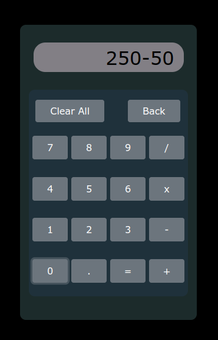
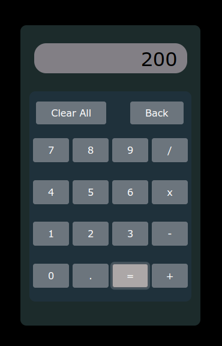

# **Calculator**

this is a basic calculator project, we can perform simple math oprations here. **Now the project is not Active**

<br/>

&nbsp;
&nbsp;


<br/>


&nbsp;&nbsp;&nbsp;&nbsp;&nbsp;

&nbsp;&nbsp;&nbsp;&nbsp;&nbsp;


### **to use the App**

```git
git clone https://github.com/Rahul0070050/Calculator.git


cd Calculator
```